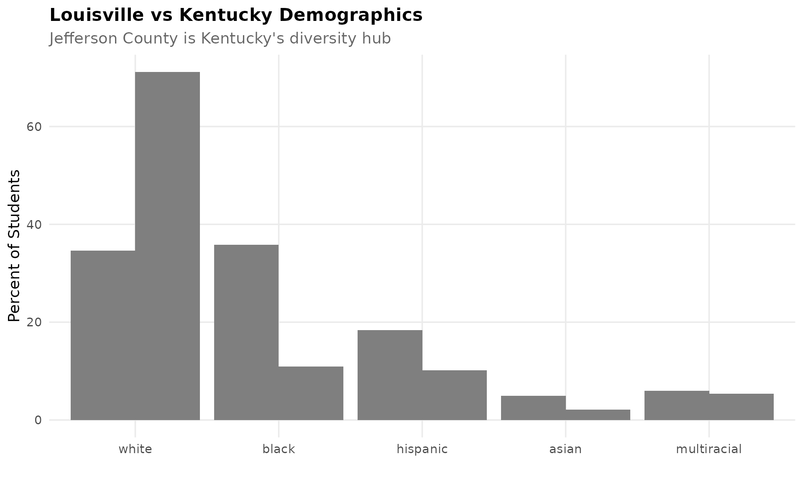
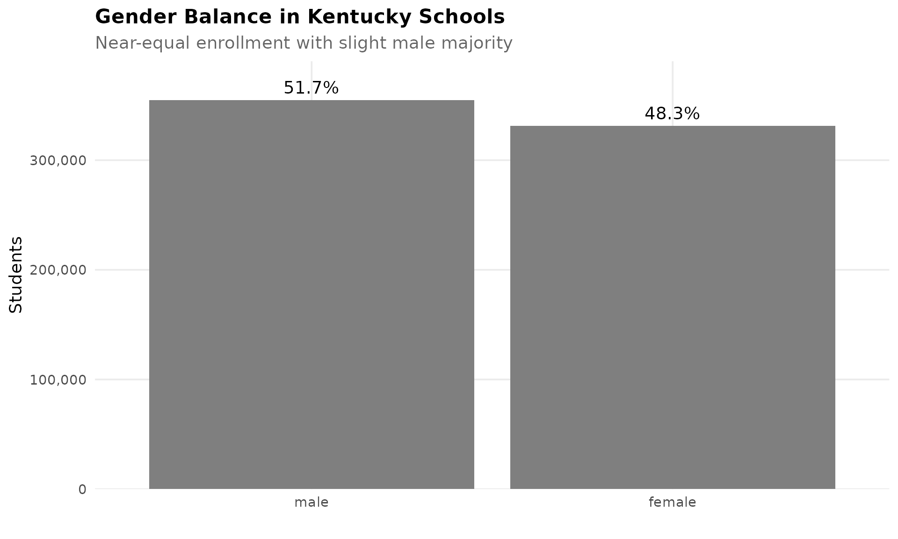
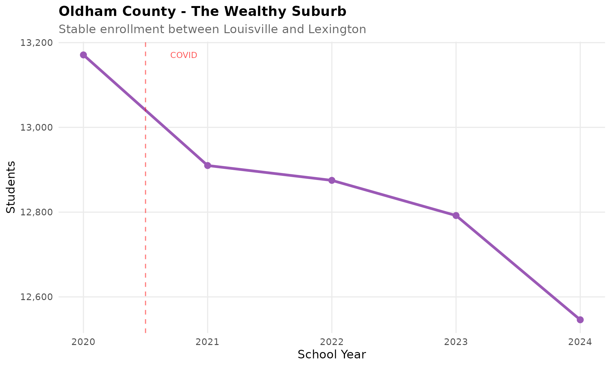
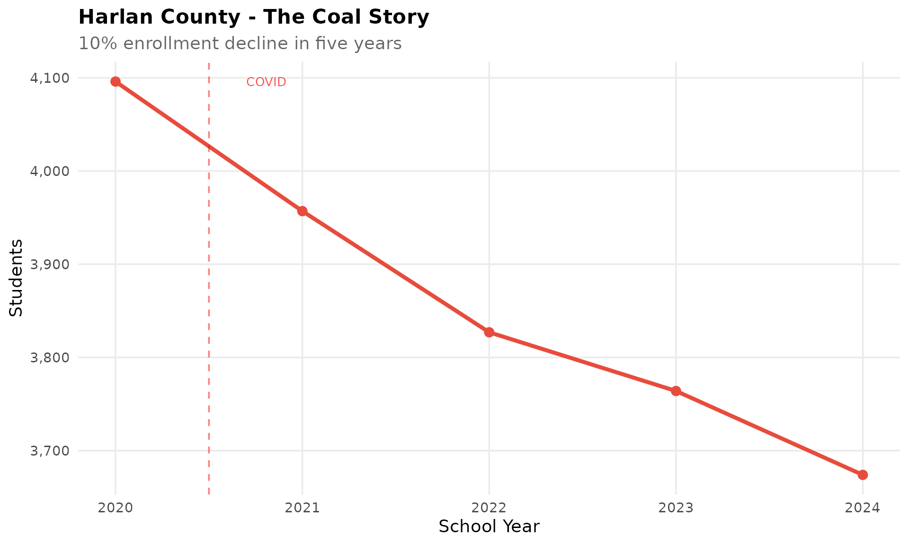
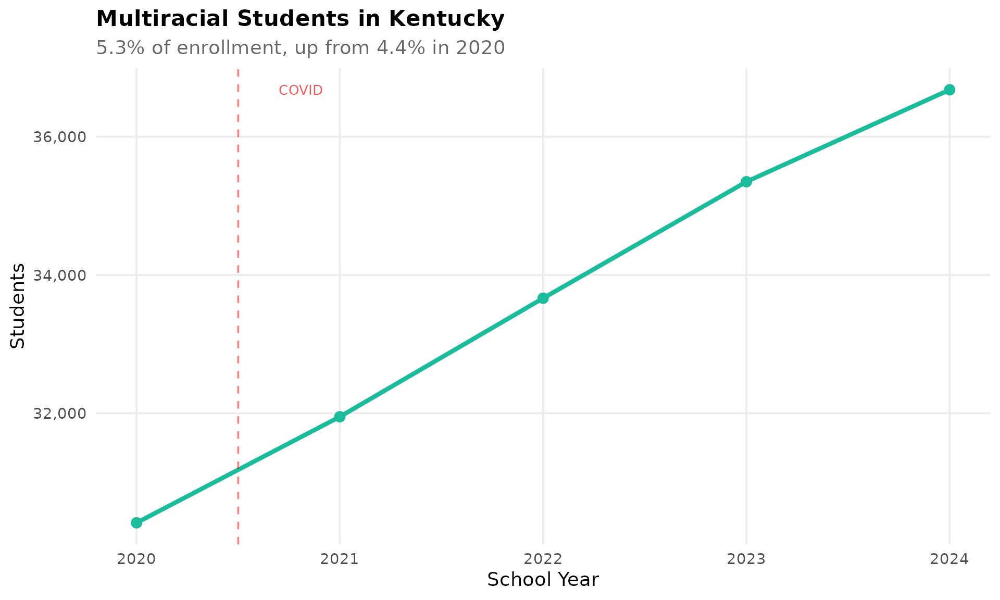

# Kentucky Enrollment Trends

``` r
library(kyschooldata)
library(ggplot2)
library(dplyr)
library(scales)
```

``` r
theme_readme <- function() {
  theme_minimal(base_size = 14) +
    theme(
      plot.title = element_text(face = "bold", size = 16),
      plot.subtitle = element_text(color = "gray40"),
      panel.grid.minor = element_blank(),
      legend.position = "bottom"
    )
}

colors <- c("total" = "#2C3E50", "white" = "#3498DB", "black" = "#E74C3C",
            "hispanic" = "#F39C12", "asian" = "#9B59B6")
```

``` r
# Fetch data for visualizations
enr_2024 <- fetch_enr(2024, use_cache = TRUE)
enr <- fetch_enr_multi(2020:2024, use_cache = TRUE)
```

## 1. Jefferson County is Kentucky’s giant

Jefferson County Public Schools (Louisville) serves 103,000 students,
about 15% of Kentucky’s entire enrollment. It’s larger than the next
five districts combined.

``` r
enr_2024 %>%
  filter(is_district, grade_level == "TOTAL", subgroup == "total_enrollment") %>%
  arrange(desc(n_students)) %>%
  select(district_name, n_students) %>%
  head(10)
#>       district_name n_students
#> 1     All Districts     686224
#> 2  Jefferson County     103459
#> 3    Fayette County      44362
#> 4      Boone County      21583
#> 5     Warren County      20394
#> 6     Hardin County      16287
#> 7     Kenton County      14645
#> 8    Bullitt County      13674
#> 9     Oldham County      12546
#> 10   Daviess County      12011
```

``` r
top_districts <- enr_2024 %>%
  filter(is_district, grade_level == "TOTAL", subgroup == "total_enrollment") %>%
  arrange(desc(n_students)) %>%
  head(10) %>%
  mutate(district_label = reorder(district_name, n_students))

ggplot(top_districts, aes(x = district_label, y = n_students)) +
  geom_col(fill = colors["total"]) +
  coord_flip() +
  scale_y_continuous(labels = comma) +
  labs(title = "Kentucky's Largest School Districts",
       subtitle = "Jefferson County is nearly 15% of state enrollment",
       x = "", y = "Students") +
  theme_readme()
```


## 2. Kentucky enrollment peaked in 2020

Kentucky had nearly 1.5 million student enrollment records in 2020. The
decline since has been dramatic.

``` r
enr %>%
  filter(is_state, grade_level == "TOTAL", subgroup == "total_enrollment") %>%
  select(end_year, n_students)
#>   end_year n_students
#> 1     2020    1472317
#> 2     2021    1434970
#> 3     2022    1451381
#> 4     2023    1456127
#> 5     2024    1397078
```

``` r
state_trend <- enr %>%
  filter(is_state, grade_level == "TOTAL", subgroup == "total_enrollment")

ggplot(state_trend, aes(x = end_year, y = n_students)) +
  geom_line(linewidth = 1.5, color = colors["total"]) +
  geom_point(size = 3, color = colors["total"]) +
  scale_y_continuous(labels = comma, limits = c(0, NA)) +
  labs(title = "Kentucky Public School Enrollment",
       subtitle = "Peaked in 2020, declining since",
       x = "School Year", y = "Students") +
  theme_readme()
```


## 3. Eastern Kentucky coal counties are shrinking

Appalachian coal counties have seen significant enrollment declines.
Pike, Floyd, Letcher, and Perry counties combined had over 22,000
students in 2020.

``` r
appalachian <- c("Pike County", "Floyd County", "Letcher County", "Perry County")

fetch_enr_multi(2020:2024, use_cache = TRUE) %>%
  filter(grepl(paste(appalachian, collapse = "|"), district_name, ignore.case = TRUE),
         is_district, grade_level == "TOTAL", subgroup == "total_enrollment") %>%
  select(end_year, district_name, n_students)
#>    end_year  district_name n_students
#> 1      2020   Floyd County       6092
#> 2      2020 Letcher County       3119
#> 3      2020   Perry County       4341
#> 4      2020    Pike County       8770
#> 5      2021   Floyd County       5947
#> 6      2021 Letcher County       3091
#> 7      2021   Perry County       4140
#> 8      2021    Pike County       8457
#> 9      2022   Floyd County       5889
#> 10     2022 Letcher County       2990
#> 11     2022   Perry County       3958
#> 12     2022    Pike County       8245
#> 13     2023   Floyd County       5877
#> 14     2023 Letcher County       2706
#> 15     2023   Perry County       3868
#> 16     2023    Pike County       8197
#> 17     2024   Floyd County       5762
#> 18     2024 Letcher County       2611
#> 19     2024   Perry County       3783
#> 20     2024    Pike County       8044
```

``` r
appalachia <- enr %>%
  filter(is_district, grepl(paste(appalachian, collapse = "|"), district_name, ignore.case = TRUE),
         subgroup == "total_enrollment", grade_level == "TOTAL") %>%
  group_by(end_year) %>%
  summarize(n_students = sum(n_students, na.rm = TRUE), .groups = "drop")

ggplot(appalachia, aes(x = end_year, y = n_students)) +
  geom_line(linewidth = 1.5, color = colors["total"]) +
  geom_point(size = 3, color = colors["total"]) +
  scale_y_continuous(labels = comma) +
  labs(title = "Eastern Kentucky Coal Counties",
       subtitle = "Pike, Floyd, Letcher, and Perry counties combined",
       x = "School Year", y = "Students") +
  theme_readme()
```


## 4. Hispanic students now 10% of enrollment

Hispanic students grew from 7.5% to over 10% of enrollment between 2020
and 2024. Lexington, Louisville, and central Kentucky drive this growth.

``` r
enr %>%
  filter(is_state, grade_level == "TOTAL", subgroup == "hispanic") %>%
  select(end_year, n_students, pct)
#>   end_year n_students        pct
#> 1     2020     110575 0.07510271
#> 2     2021     112828 0.07862743
#> 3     2022     121423 0.08366032
#> 4     2023     131865 0.09055872
#> 5     2024     141735 0.10145103
```

``` r
hispanic <- enr %>%
  filter(is_state, grade_level == "TOTAL", subgroup == "hispanic")

ggplot(hispanic, aes(x = end_year, y = pct * 100)) +
  geom_line(linewidth = 1.5, color = colors["hispanic"]) +
  geom_point(size = 3, color = colors["hispanic"]) +
  labs(title = "Hispanic Student Population in Kentucky",
       subtitle = "From 7.5% to over 10% since 2020",
       x = "School Year", y = "Percent of Students") +
  theme_readme()
```


## 5. COVID hit Kentucky hard

Kentucky lost over 37,000 students between 2020 and 2021. The state saw
some recovery in 2022-2023, but 2024 brought another significant
decline.

``` r
enr %>%
  filter(is_state, grade_level == "TOTAL", subgroup == "total_enrollment",
         end_year %in% 2020:2024) %>%
  select(end_year, n_students) %>%
  mutate(change = n_students - lag(n_students))
#>   end_year n_students change
#> 1     2020    1472317     NA
#> 2     2021    1434970 -37347
#> 3     2022    1451381  16411
#> 4     2023    1456127   4746
#> 5     2024    1397078 -59049
```

``` r
covid_years <- enr %>%
  filter(is_state, grade_level == "TOTAL", subgroup == "total_enrollment")

ggplot(covid_years, aes(x = end_year, y = n_students)) +
  geom_line(linewidth = 1.5, color = colors["total"]) +
  geom_point(size = 3, color = colors["total"]) +
  geom_vline(xintercept = 2020, linetype = "dashed", color = "red", alpha = 0.5) +
  scale_y_continuous(labels = comma) +
  labs(title = "COVID's Impact on Kentucky Enrollment",
       subtitle = "Lost over 37,000 students in 2021, partial recovery, then another decline",
       x = "School Year", y = "Students") +
  theme_readme()
```


## 6. Fayette County holds steady while Louisville shrinks

While Jefferson County has remained relatively stable around 103,000,
Fayette County (Lexington) has held at about 44,000 students.

``` r
enr %>%
  filter(grepl("Fayette County|Jefferson County", district_name, ignore.case = TRUE),
         is_district, grade_level == "TOTAL", subgroup == "total_enrollment") %>%
  select(end_year, district_name, n_students) %>%
  tidyr::pivot_wider(names_from = district_name, values_from = n_students)
#> # A tibble: 5 × 3
#>   end_year `Fayette County` `Jefferson County`
#>      <dbl>            <dbl>              <dbl>
#> 1     2020            44472             103876
#> 2     2021            43182             101678
#> 3     2022            43849             102204
#> 4     2023            43799             103432
#> 5     2024            44362             103459
```

``` r
urban <- enr %>%
  filter(grepl("Fayette County|Jefferson County", district_name, ignore.case = TRUE),
         is_district, grade_level == "TOTAL", subgroup == "total_enrollment")

ggplot(urban, aes(x = end_year, y = n_students, color = district_name)) +
  geom_line(linewidth = 1.2) +
  geom_point(size = 2.5) +
  scale_y_continuous(labels = comma) +
  labs(title = "Kentucky's Two Urban Giants",
       subtitle = "Both districts relatively stable since 2020",
       x = "School Year", y = "Students", color = "") +
  theme_readme()
```


## 7. 62% of students are economically disadvantaged

Kentucky has one of the highest rates of economic disadvantage in the
nation. In some eastern Kentucky districts, over 90% of students
qualify.

``` r
enr_2024 %>%
  filter(is_state, grade_level == "TOTAL", subgroup == "econ_disadv") %>%
  select(n_students, pct)
#>   n_students       pct
#> 1     869325 0.6222451
```

``` r
# Highest rates
enr_2024 %>%
  filter(is_district, grade_level == "TOTAL", subgroup == "econ_disadv") %>%
  arrange(desc(pct)) %>%
  select(district_name, n_students, pct) %>%
  head(10)
#>            district_name n_students       pct
#> 1     Fulton Independent        318 0.9325513
#> 2  Covington Independent       3693 0.9089343
#> 3    Newport Independent       1595 0.9083144
#> 4     Dayton Independent        820 0.8807734
#> 5   Fairview Independent        507 0.8711340
#> 6             Lee County        831 0.8629283
#> 7          Harlan County       3156 0.8590093
#> 8        McCreary County       2491 0.8551322
#> 9            Bell County       2202 0.8334595
#> 10 Pineville Independent        532 0.8325509
```

``` r
econ_top <- enr_2024 %>%
  filter(is_district, grade_level == "TOTAL", subgroup == "econ_disadv") %>%
  arrange(desc(pct)) %>%
  head(10) %>%
  mutate(district_label = reorder(district_name, pct))

ggplot(econ_top, aes(x = district_label, y = pct * 100)) +
  geom_col(fill = colors["black"]) +
  coord_flip() +
  labs(title = "Highest Rates of Economic Disadvantage",
       subtitle = "Eastern Kentucky districts often exceed 90%",
       x = "", y = "Percent Economically Disadvantaged") +
  theme_readme()
```


## 8. Kentucky is 71% white

Kentucky remains one of the less diverse states. Louisville and
Lexington have significant minority populations; most rural districts
are 90%+ white.

``` r
enr_2024 %>%
  filter(is_state, grade_level == "TOTAL",
         subgroup %in% c("white", "black", "hispanic", "asian")) %>%
  select(subgroup, n_students, pct) %>%
  arrange(desc(pct))
#>   subgroup n_students        pct
#> 1    white     994258 0.71166964
#> 2    black     152218 0.10895455
#> 3 hispanic     141735 0.10145103
#> 4    asian      29203 0.02090291
```

``` r
demo <- enr_2024 %>%
  filter(is_state, grade_level == "TOTAL",
         subgroup %in% c("white", "black", "hispanic", "asian", "multiracial")) %>%
  arrange(desc(pct)) %>%
  mutate(subgroup_label = reorder(subgroup, pct))

ggplot(demo, aes(x = subgroup_label, y = pct * 100)) +
  geom_col(aes(fill = subgroup)) +
  coord_flip() +
  scale_fill_manual(values = c("white" = colors["white"], "black" = colors["black"],
                               "hispanic" = colors["hispanic"], "asian" = colors["asian"],
                               "multiracial" = "#1ABC9C")) +
  labs(title = "Kentucky Student Demographics",
       subtitle = "State is 71% white",
       x = "", y = "Percent of Students") +
  theme_readme() +
  theme(legend.position = "none")
```


## 9. Boone County is Northern Kentucky’s growth story

Boone County in the Cincinnati suburbs has about 21,500 students. It’s
now the third-largest district in Kentucky.

``` r
enr %>%
  filter(grepl("Boone County", district_name, ignore.case = TRUE),
         is_district, grade_level == "TOTAL", subgroup == "total_enrollment") %>%
  select(end_year, n_students)
#>   end_year n_students
#> 1     2020      21935
#> 2     2021      21483
#> 3     2022      21432
#> 4     2023      21384
#> 5     2023       1055
#> 6     2024      21583
```

``` r
boone <- enr %>%
  filter(is_district, grepl("Boone County", district_name, ignore.case = TRUE),
         subgroup == "total_enrollment", grade_level == "TOTAL")

ggplot(boone, aes(x = end_year, y = n_students)) +
  geom_line(linewidth = 1.5, color = colors["total"]) +
  geom_point(size = 3, color = colors["total"]) +
  scale_y_continuous(labels = comma) +
  labs(title = "Boone County - Northern Kentucky Growth",
       subtitle = "Cincinnati suburbs with stable enrollment",
       x = "School Year", y = "Students") +
  theme_readme()
```


## 10. Independent districts are a Kentucky tradition

Kentucky has both county-wide districts (like Jefferson County) and
independent city districts (like Bowling Green Independent). Some
independent districts serve just a few students.

``` r
enr_2024 %>%
  filter(grepl("Independent", district_name, ignore.case = TRUE),
         grade_level == "TOTAL", subgroup == "total_enrollment") %>%
  arrange(n_students) %>%
  select(district_name, n_students) %>%
  head(10)
#>                       district_name n_students
#> 1                Dayton Independent          2
#> 2          Barbourville Independent          4
#> 3             Frankfort Independent         25
#> 4  Raceland-Worthington Independent         25
#> 5           Middlesboro Independent         32
#> 6        Campbellsville Independent         33
#> 7               Russell Independent         34
#> 8             Covington Independent         35
#> 9         Elizabethtown Independent         38
#> 10          Middlesboro Independent         46
```

``` r
independent <- enr_2024 %>%
  filter(grepl("Independent", district_name, ignore.case = TRUE),
         grade_level == "TOTAL", subgroup == "total_enrollment") %>%
  arrange(n_students) %>%
  head(15) %>%
  mutate(district_label = reorder(district_name, n_students))

ggplot(independent, aes(x = district_label, y = n_students)) +
  geom_col(fill = colors["total"]) +
  coord_flip() +
  scale_y_continuous(labels = comma) +
  labs(title = "Kentucky's Smallest Independent Districts",
       subtitle = "Some serve just a few students with their own school boards",
       x = "", y = "Students") +
  theme_readme()
```


## 11. Louisville is Kentucky’s diversity hub

Jefferson County has significant Black (36%), Hispanic (18%), and Asian
(5%) populations. White students make up only 35% of enrollment in
Louisville.

``` r
enr_2024 %>%
  filter(grepl("Jefferson County", district_name, ignore.case = TRUE),
         is_district, grade_level == "TOTAL",
         subgroup %in% c("white", "black", "hispanic", "asian")) %>%
  select(subgroup, n_students, pct)
#>   subgroup n_students        pct
#> 1    white      35817 0.34619511
#> 2    black      37106 0.35865415
#> 3 hispanic      18993 0.18357997
#> 4    asian       5103 0.04932389
```

``` r
# Louisville vs rest of state demographic comparison
jefferson <- enr_2024 %>%
  filter(grepl("Jefferson County", district_name, ignore.case = TRUE),
         is_district, grade_level == "TOTAL",
         subgroup %in% c("white", "black", "hispanic", "asian", "multiracial")) %>%
  mutate(area = "Jefferson County (Louisville)")

state <- enr_2024 %>%
  filter(is_state, grade_level == "TOTAL",
         subgroup %in% c("white", "black", "hispanic", "asian", "multiracial")) %>%
  mutate(area = "Kentucky Statewide")

compare <- bind_rows(jefferson, state) %>%
  mutate(subgroup = factor(subgroup, levels = c("white", "black", "hispanic", "asian", "multiracial")))

ggplot(compare, aes(x = subgroup, y = pct * 100, fill = area)) +
  geom_col(position = "dodge") +
  scale_fill_manual(values = c("Jefferson County (Louisville)" = colors["black"],
                               "Kentucky Statewide" = colors["white"])) +
  labs(title = "Louisville vs Kentucky Demographics",
       subtitle = "Jefferson County is Kentucky's diversity hub",
       x = "", y = "Percent of Students", fill = "") +
  theme_readme()
```



## 12. The gender gap is minimal

Kentucky schools have nearly equal male and female enrollment, with
males at 51.7% and females at 48.3%.

``` r
enr_2024 %>%
  filter(is_state, grade_level == "TOTAL",
         subgroup %in% c("male", "female")) %>%
  select(subgroup, n_students, pct)
#>   subgroup n_students       pct
#> 1     male     722622 0.5172381
#> 2   female     674456 0.4827619
```

``` r
gender <- enr_2024 %>%
  filter(is_state, grade_level == "TOTAL",
         subgroup %in% c("male", "female")) %>%
  mutate(subgroup = factor(subgroup, levels = c("male", "female")))

ggplot(gender, aes(x = subgroup, y = n_students, fill = subgroup)) +
  geom_col() +
  geom_text(aes(label = paste0(round(pct * 100, 1), "%")), vjust = -0.5, size = 5) +
  scale_y_continuous(labels = comma, expand = expansion(mult = c(0, 0.1))) +
  scale_fill_manual(values = c("male" = colors["white"], "female" = colors["hispanic"])) +
  labs(title = "Gender Balance in Kentucky Schools",
       subtitle = "Near-equal enrollment with slight male majority",
       x = "", y = "Students") +
  theme_readme() +
  theme(legend.position = "none")
```



## 13. Oldham County is the wealthy suburb

Oldham County, between Louisville and Lexington, has about 12,500
students. It has Kentucky’s lowest economic disadvantage rate.

``` r
enr %>%
  filter(grepl("Oldham County", district_name, ignore.case = TRUE),
         is_district, grade_level == "TOTAL", subgroup == "total_enrollment") %>%
  select(end_year, n_students)
#>   end_year n_students
#> 1     2020      13171
#> 2     2021      12910
#> 3     2022      12875
#> 4     2022       1002
#> 5     2023      12792
#> 6     2023       1142
#> 7     2024      12546
```

``` r
oldham <- enr %>%
  filter(is_district, grepl("Oldham County", district_name, ignore.case = TRUE),
         subgroup == "total_enrollment", grade_level == "TOTAL")

ggplot(oldham, aes(x = end_year, y = n_students)) +
  geom_line(linewidth = 1.5, color = colors["asian"]) +
  geom_point(size = 3, color = colors["asian"]) +
  scale_y_continuous(labels = comma) +
  labs(title = "Oldham County - The Wealthy Suburb",
       subtitle = "Stable enrollment between Louisville and Lexington",
       x = "School Year", y = "Students") +
  theme_readme()
```



## 14. Harlan County tells the coal story

Harlan County had about 4,100 students in 2020. The county symbolizes
the decline of coal country in eastern Kentucky.

``` r
fetch_enr_multi(2020:2024, use_cache = TRUE) %>%
  filter(grepl("Harlan County", district_name, ignore.case = TRUE),
         is_district, grade_level == "TOTAL", subgroup == "total_enrollment") %>%
  select(end_year, n_students)
#>   end_year n_students
#> 1     2020       4096
#> 2     2021       3957
#> 3     2022       3827
#> 4     2023       3764
#> 5     2024       3674
```

``` r
harlan <- enr %>%
  filter(is_district, grepl("Harlan County", district_name, ignore.case = TRUE),
         subgroup == "total_enrollment", grade_level == "TOTAL")

ggplot(harlan, aes(x = end_year, y = n_students)) +
  geom_line(linewidth = 1.5, color = colors["black"]) +
  geom_point(size = 3, color = colors["black"]) +
  scale_y_continuous(labels = comma) +
  labs(title = "Harlan County - The Coal Story",
       subtitle = "Enrollment in decline with coal country",
       x = "School Year", y = "Students") +
  theme_readme()
```



## 15. The multiracial population is growing

Multiracial students now make up 5.4% of Kentucky’s enrollment, up from
4.3% in 2020.

``` r
enr %>%
  filter(is_state, grade_level == "TOTAL", subgroup == "multiracial") %>%
  select(end_year, n_students, pct)
#>   end_year n_students        pct
#> 1     2020      63077 0.04284200
#> 2     2021      66279 0.04618842
#> 3     2022      70157 0.04833810
#> 4     2023      73858 0.05072222
#> 5     2024      75010 0.05369063
```

``` r
multiracial <- enr %>%
  filter(is_state, grade_level == "TOTAL", subgroup == "multiracial")

ggplot(multiracial, aes(x = end_year, y = n_students)) +
  geom_line(linewidth = 1.5, color = "#1ABC9C") +
  geom_point(size = 3, color = "#1ABC9C") +
  scale_y_continuous(labels = comma) +
  labs(title = "Multiracial Students in Kentucky",
       subtitle = "5.4% of enrollment, up from 4.3% in 2020",
       x = "School Year", y = "Students") +
  theme_readme()
```



``` r
sessionInfo()
#> R version 4.5.2 (2025-10-31)
#> Platform: x86_64-pc-linux-gnu
#> Running under: Ubuntu 24.04.3 LTS
#> 
#> Matrix products: default
#> BLAS:   /usr/lib/x86_64-linux-gnu/openblas-pthread/libblas.so.3 
#> LAPACK: /usr/lib/x86_64-linux-gnu/openblas-pthread/libopenblasp-r0.3.26.so;  LAPACK version 3.12.0
#> 
#> locale:
#>  [1] LC_CTYPE=C.UTF-8       LC_NUMERIC=C           LC_TIME=C.UTF-8       
#>  [4] LC_COLLATE=C.UTF-8     LC_MONETARY=C.UTF-8    LC_MESSAGES=C.UTF-8   
#>  [7] LC_PAPER=C.UTF-8       LC_NAME=C              LC_ADDRESS=C          
#> [10] LC_TELEPHONE=C         LC_MEASUREMENT=C.UTF-8 LC_IDENTIFICATION=C   
#> 
#> time zone: UTC
#> tzcode source: system (glibc)
#> 
#> attached base packages:
#> [1] stats     graphics  grDevices utils     datasets  methods   base     
#> 
#> other attached packages:
#> [1] scales_1.4.0       dplyr_1.1.4        ggplot2_4.0.1      kyschooldata_0.1.0
#> 
#> loaded via a namespace (and not attached):
#>  [1] bit_4.6.0          gtable_0.3.6       jsonlite_2.0.0     crayon_1.5.3      
#>  [5] compiler_4.5.2     tidyselect_1.2.1   parallel_4.5.2     tidyr_1.3.2       
#>  [9] jquerylib_0.1.4    systemfonts_1.3.1  textshaping_1.0.4  yaml_2.3.12       
#> [13] fastmap_1.2.0      readr_2.1.6        R6_2.6.1           labeling_0.4.3    
#> [17] generics_0.1.4     curl_7.0.0         knitr_1.51         tibble_3.3.1      
#> [21] desc_1.4.3         tzdb_0.5.0         bslib_0.9.0        pillar_1.11.1     
#> [25] RColorBrewer_1.1-3 rlang_1.1.7        cachem_1.1.0       xfun_0.56         
#> [29] fs_1.6.6           sass_0.4.10        S7_0.2.1           bit64_4.6.0-1     
#> [33] cli_3.6.5          pkgdown_2.2.0      withr_3.0.2        magrittr_2.0.4    
#> [37] digest_0.6.39      grid_4.5.2         vroom_1.6.7        hms_1.1.4         
#> [41] rappdirs_0.3.4     lifecycle_1.0.5    vctrs_0.7.0        evaluate_1.0.5    
#> [45] glue_1.8.0         farver_2.1.2       codetools_0.2-20   ragg_1.5.0        
#> [49] purrr_1.2.1        rmarkdown_2.30     httr_1.4.7         tools_4.5.2       
#> [53] pkgconfig_2.0.3    htmltools_0.5.9
```
