# Kentucky Enrollment Trends

``` r
library(kyschooldata)
library(ggplot2)
library(dplyr)
library(scales)
```

``` r
theme_readme <- function() {
  theme_minimal(base_size = 14) +
    theme(
      plot.title = element_text(face = "bold", size = 16),
      plot.subtitle = element_text(color = "gray40"),
      panel.grid.minor = element_blank(),
      legend.position = "bottom"
    )
}

colors <- c("total" = "#2C3E50", "white" = "#3498DB", "black" = "#E74C3C",
            "hispanic" = "#F39C12", "asian" = "#9B59B6")
```

``` r
# Fetch data for visualizations
enr_2024 <- tryCatch(
  fetch_enr(2024, use_cache = TRUE),
  error = function(e) {
    warning("Failed to fetch 2024 enrollment data: ", e$message)
    NULL
  }
)
stopifnot(!is.null(enr_2024))

enr <- tryCatch(
  fetch_enr_multi(2020:2024, use_cache = TRUE),
  error = function(e) {
    warning("Failed to fetch multi-year enrollment data: ", e$message)
    NULL
  }
)
stopifnot(!is.null(enr))
```

## 1. Jefferson County is Kentucky’s giant

Jefferson County Public Schools (Louisville) serves 103,000 students,
about 15% of Kentucky’s entire enrollment. It’s larger than the next
five districts combined.

``` r
s1 <- enr_2024 %>%
  filter(is_district, grade_level == "TOTAL", subgroup == "total_enrollment") %>%
  arrange(desc(n_students)) %>%
  select(district_name, n_students) %>%
  head(10)
stopifnot(nrow(s1) > 0)
s1
#>       district_name n_students
#> 1  Jefferson County     103459
#> 2    Fayette County      44362
#> 3      Boone County      21583
#> 4     Warren County      20394
#> 5     Hardin County      16287
#> 6     Kenton County      14645
#> 7    Bullitt County      13674
#> 8     Oldham County      12546
#> 9    Daviess County      12011
#> 10   Madison County      12007
```

``` r
top_districts <- enr_2024 %>%
  filter(is_district, grade_level == "TOTAL", subgroup == "total_enrollment") %>%
  arrange(desc(n_students)) %>%
  head(10) %>%
  mutate(district_label = reorder(district_name, n_students))
stopifnot(nrow(top_districts) > 0)

print(top_districts %>% select(district_name, n_students))
#>       district_name n_students
#> 1  Jefferson County     103459
#> 2    Fayette County      44362
#> 3      Boone County      21583
#> 4     Warren County      20394
#> 5     Hardin County      16287
#> 6     Kenton County      14645
#> 7    Bullitt County      13674
#> 8     Oldham County      12546
#> 9    Daviess County      12011
#> 10   Madison County      12007

ggplot(top_districts, aes(x = district_label, y = n_students)) +
  geom_col(fill = colors["total"]) +
  coord_flip() +
  scale_y_continuous(labels = comma) +
  labs(title = "Kentucky's Largest School Districts",
       subtitle = "Jefferson County is nearly 15% of state enrollment",
       x = "", y = "Students") +
  theme_readme()
```

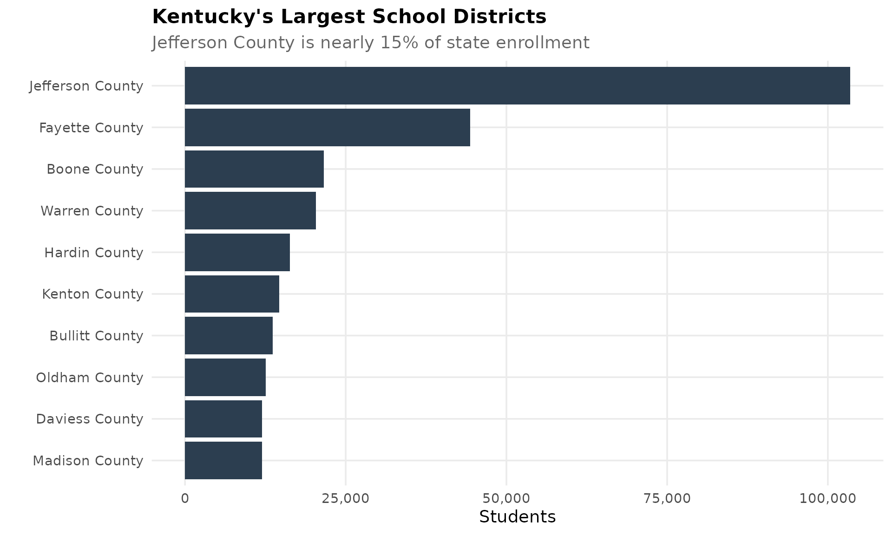

## 2. Kentucky enrollment has held steady near 686,000

Kentucky enrolled 698,000 students in 2020 and 686,000 in 2024 – a
modest 1.7% decline over five years. Despite COVID disruptions,
enrollment has been remarkably stable.

``` r
s2 <- enr %>%
  filter(is_state, grade_level == "TOTAL", subgroup == "total_enrollment") %>%
  select(end_year, n_students)
stopifnot(nrow(s2) > 0)
s2
#>   end_year n_students
#> 1     2020     698388
#> 2     2021     682953
#> 3     2022     685401
#> 4     2023     687294
#> 5     2024     686224
```

``` r
state_trend <- enr %>%
  filter(is_state, grade_level == "TOTAL", subgroup == "total_enrollment")
stopifnot(nrow(state_trend) > 0)

print(state_trend %>% select(end_year, n_students))
#>   end_year n_students
#> 1     2020     698388
#> 2     2021     682953
#> 3     2022     685401
#> 4     2023     687294
#> 5     2024     686224

ggplot(state_trend, aes(x = end_year, y = n_students)) +
  geom_line(linewidth = 1.5, color = colors["total"]) +
  geom_point(size = 3, color = colors["total"]) +
  geom_vline(xintercept = 2020.5, linetype = "dashed", color = "red", alpha = 0.5) +
  annotate("text", x = 2020.7, y = max(state_trend$n_students), label = "COVID",
           color = "red", alpha = 0.7, hjust = 0, size = 3.5) +
  scale_y_continuous(labels = comma, limits = c(0, NA)) +
  labs(title = "Kentucky Public School Enrollment",
       subtitle = "Stable near 686,000 students since 2020",
       x = "School Year", y = "Students") +
  theme_readme()
```

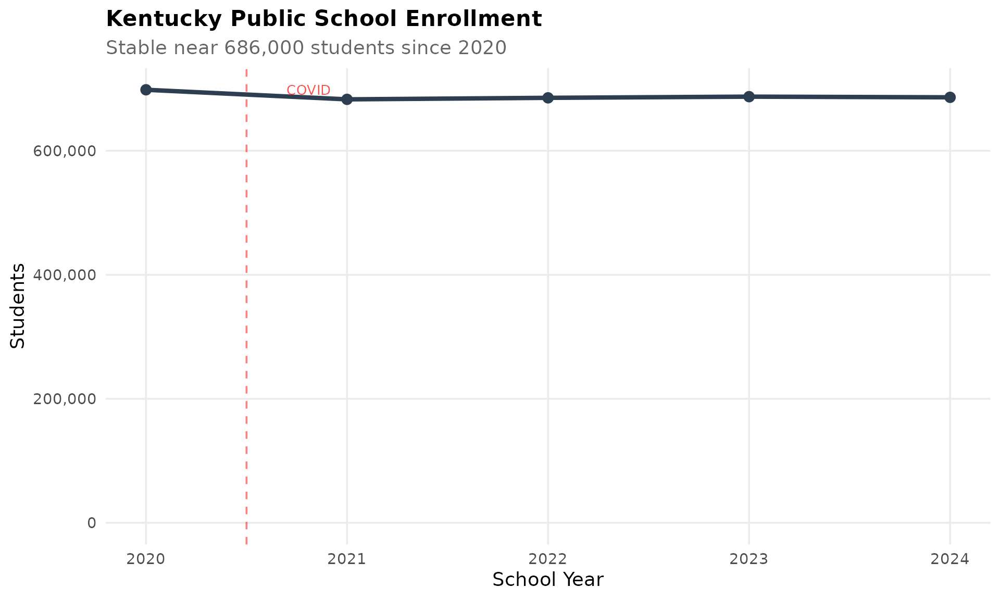

## 3. Eastern Kentucky coal counties are shrinking

Appalachian coal counties have seen significant enrollment declines.
Pike, Floyd, Letcher, and Perry counties combined had over 22,000
students in 2020, dropping to about 20,200 by 2024.

``` r
appalachian <- c("Pike County", "Floyd County", "Letcher County", "Perry County")

s3 <- tryCatch(
  fetch_enr_multi(2020:2024, use_cache = TRUE),
  error = function(e) {
    warning("Failed to fetch coal county data: ", e$message)
    NULL
  }
)
stopifnot(!is.null(s3))

s3 <- s3 %>%
  filter(grepl(paste(appalachian, collapse = "|"), district_name, ignore.case = TRUE),
         is_district, grade_level == "TOTAL", subgroup == "total_enrollment") %>%
  select(end_year, district_name, n_students)
stopifnot(nrow(s3) > 0)
s3
#>    end_year  district_name n_students
#> 1      2020    Pike County       8770
#> 2      2020   Floyd County       6092
#> 3      2020   Perry County       4341
#> 4      2020 Letcher County       3119
#> 5      2021    Pike County       8457
#> 6      2021   Floyd County       5947
#> 7      2021   Perry County       4140
#> 8      2021 Letcher County       3091
#> 9      2022    Pike County       8245
#> 10     2022   Floyd County       5889
#> 11     2022   Perry County       3958
#> 12     2022 Letcher County       2990
#> 13     2023    Pike County       8197
#> 14     2023   Floyd County       5877
#> 15     2023   Perry County       3868
#> 16     2023 Letcher County       2706
#> 17     2024    Pike County       8044
#> 18     2024   Floyd County       5762
#> 19     2024   Perry County       3783
#> 20     2024 Letcher County       2611
```

``` r
appalachia <- enr %>%
  filter(is_district, grepl(paste(appalachian, collapse = "|"), district_name, ignore.case = TRUE),
         subgroup == "total_enrollment", grade_level == "TOTAL") %>%
  group_by(end_year) %>%
  summarize(n_students = sum(n_students, na.rm = TRUE), .groups = "drop")
stopifnot(nrow(appalachia) > 0)

print(appalachia)
#> # A tibble: 5 × 2
#>   end_year n_students
#>      <dbl>      <dbl>
#> 1     2020      22322
#> 2     2021      21635
#> 3     2022      21082
#> 4     2023      20648
#> 5     2024      20200

ggplot(appalachia, aes(x = end_year, y = n_students)) +
  geom_line(linewidth = 1.5, color = colors["total"]) +
  geom_point(size = 3, color = colors["total"]) +
  geom_vline(xintercept = 2020.5, linetype = "dashed", color = "red", alpha = 0.5) +
  annotate("text", x = 2020.7, y = max(appalachia$n_students), label = "COVID",
           color = "red", alpha = 0.7, hjust = 0, size = 3.5) +
  scale_y_continuous(labels = comma) +
  labs(title = "Eastern Kentucky Coal Counties",
       subtitle = "Pike, Floyd, Letcher, and Perry counties combined",
       x = "School Year", y = "Students") +
  theme_readme()
```

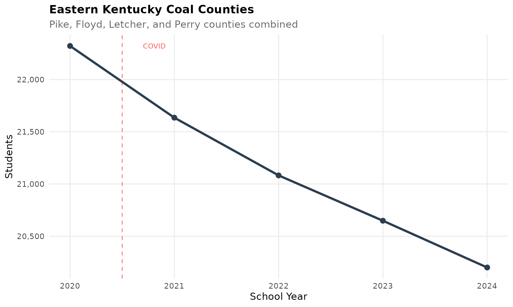

## 4. Hispanic students now 10% of enrollment

Hispanic students grew from 7.7% to over 10% of enrollment between 2020
and 2024. Lexington, Louisville, and central Kentucky drive this growth.

``` r
s4 <- enr %>%
  filter(is_state, grade_level == "TOTAL", subgroup == "hispanic") %>%
  select(end_year, n_students, pct)
stopifnot(nrow(s4) > 0)
s4
#>   end_year n_students        pct
#> 1     2020      53493 0.07659496
#> 2     2021      54658 0.08003186
#> 3     2022      58578 0.08546530
#> 4     2023      63502 0.09239423
#> 5     2024      69877 0.10182827
```

``` r
hispanic <- enr %>%
  filter(is_state, grade_level == "TOTAL", subgroup == "hispanic")
stopifnot(nrow(hispanic) > 0)

print(hispanic %>% select(end_year, n_students, pct))
#>   end_year n_students        pct
#> 1     2020      53493 0.07659496
#> 2     2021      54658 0.08003186
#> 3     2022      58578 0.08546530
#> 4     2023      63502 0.09239423
#> 5     2024      69877 0.10182827

ggplot(hispanic, aes(x = end_year, y = pct * 100)) +
  geom_line(linewidth = 1.5, color = colors["hispanic"]) +
  geom_point(size = 3, color = colors["hispanic"]) +
  geom_vline(xintercept = 2020.5, linetype = "dashed", color = "red", alpha = 0.5) +
  annotate("text", x = 2020.7, y = max(hispanic$pct * 100), label = "COVID",
           color = "red", alpha = 0.7, hjust = 0, size = 3.5) +
  labs(title = "Hispanic Student Population in Kentucky",
       subtitle = "From 7.7% to over 10% since 2020",
       x = "School Year", y = "Percent of Students") +
  theme_readme()
```

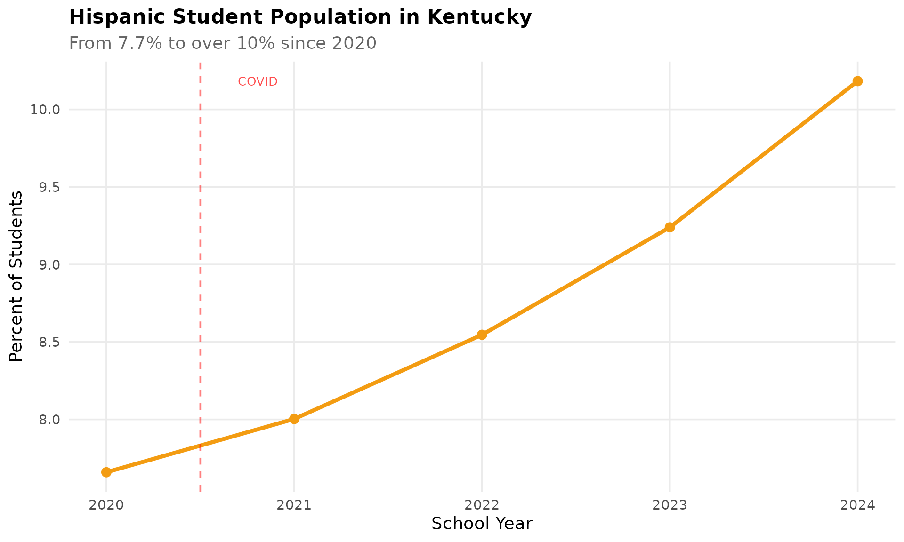

## 5. COVID dipped enrollment by 15,000 students

Kentucky lost over 15,000 students between 2020 and 2021. The state
recovered modestly in 2022-2023 before a slight decline in 2024.

``` r
s5 <- enr %>%
  filter(is_state, grade_level == "TOTAL", subgroup == "total_enrollment",
         end_year %in% 2020:2024) %>%
  select(end_year, n_students) %>%
  mutate(change = n_students - lag(n_students))
stopifnot(nrow(s5) > 0)
s5
#>   end_year n_students change
#> 1     2020     698388     NA
#> 2     2021     682953 -15435
#> 3     2022     685401   2448
#> 4     2023     687294   1893
#> 5     2024     686224  -1070
```

``` r
covid_years <- enr %>%
  filter(is_state, grade_level == "TOTAL", subgroup == "total_enrollment")
stopifnot(nrow(covid_years) > 0)

print(covid_years %>% select(end_year, n_students))
#>   end_year n_students
#> 1     2020     698388
#> 2     2021     682953
#> 3     2022     685401
#> 4     2023     687294
#> 5     2024     686224

ggplot(covid_years, aes(x = end_year, y = n_students)) +
  geom_line(linewidth = 1.5, color = colors["total"]) +
  geom_point(size = 3, color = colors["total"]) +
  geom_vline(xintercept = 2020.5, linetype = "dashed", color = "red", alpha = 0.5) +
  annotate("text", x = 2020.7, y = max(covid_years$n_students), label = "COVID",
           color = "red", alpha = 0.7, hjust = 0, size = 3.5) +
  scale_y_continuous(labels = comma) +
  labs(title = "COVID's Impact on Kentucky Enrollment",
       subtitle = "Lost over 15,000 students in 2021, then gradual recovery",
       x = "School Year", y = "Students") +
  theme_readme()
```

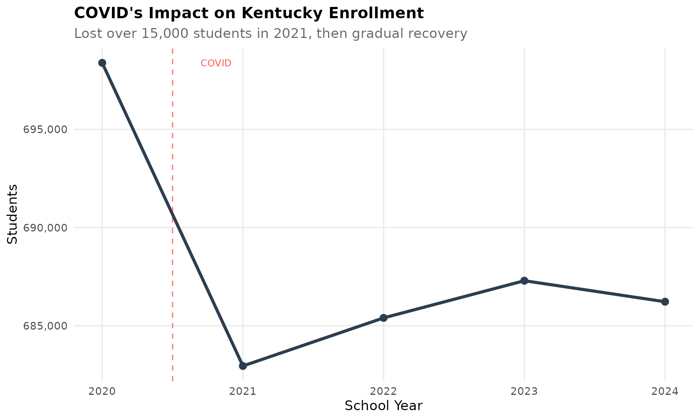

## 6. Fayette County holds steady alongside Louisville

While Jefferson County has remained relatively stable around 103,000,
Fayette County (Lexington) has held at about 44,000 students. Both
districts show resilience despite statewide pressures.

``` r
s6 <- enr %>%
  filter(grepl("Fayette County|Jefferson County", district_name, ignore.case = TRUE),
         is_district, grade_level == "TOTAL", subgroup == "total_enrollment") %>%
  select(end_year, district_name, n_students) %>%
  tidyr::pivot_wider(names_from = district_name, values_from = n_students)
stopifnot(nrow(s6) > 0)
s6
#> # A tibble: 5 × 3
#>   end_year `Jefferson County` `Fayette County`
#>      <dbl>              <dbl>            <dbl>
#> 1     2020             103876            44472
#> 2     2021             101678            43182
#> 3     2022             102204            43849
#> 4     2023             103432            43799
#> 5     2024             103459            44362
```

``` r
urban <- enr %>%
  filter(grepl("Fayette County|Jefferson County", district_name, ignore.case = TRUE),
         is_district, grade_level == "TOTAL", subgroup == "total_enrollment")
stopifnot(nrow(urban) > 0)

print(urban %>% select(end_year, district_name, n_students))
#>    end_year    district_name n_students
#> 1      2020 Jefferson County     103876
#> 2      2020   Fayette County      44472
#> 3      2021 Jefferson County     101678
#> 4      2021   Fayette County      43182
#> 5      2022 Jefferson County     102204
#> 6      2022   Fayette County      43849
#> 7      2023 Jefferson County     103432
#> 8      2023   Fayette County      43799
#> 9      2024 Jefferson County     103459
#> 10     2024   Fayette County      44362

ggplot(urban, aes(x = end_year, y = n_students, color = district_name)) +
  geom_line(linewidth = 1.2) +
  geom_point(size = 2.5) +
  geom_vline(xintercept = 2020.5, linetype = "dashed", color = "red", alpha = 0.5) +
  annotate("text", x = 2020.7, y = max(urban$n_students), label = "COVID",
           color = "red", alpha = 0.7, hjust = 0, size = 3.5) +
  scale_y_continuous(labels = comma) +
  labs(title = "Kentucky's Two Urban Giants",
       subtitle = "Both districts relatively stable since 2020",
       x = "School Year", y = "Students", color = "") +
  theme_readme()
```

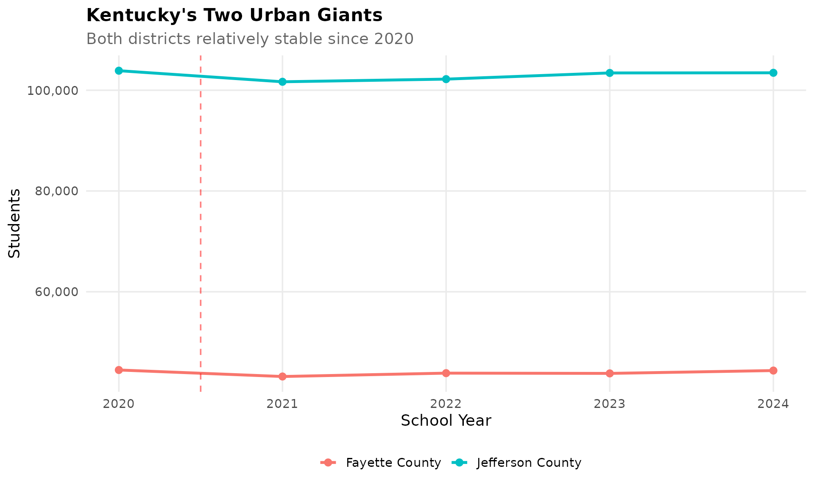

## 7. 62% of students are economically disadvantaged

Kentucky has one of the highest rates of economic disadvantage in the
nation. In some eastern Kentucky districts, over 90% of students
qualify.

``` r
s7a <- enr_2024 %>%
  filter(is_state, grade_level == "TOTAL", subgroup == "econ_disadv") %>%
  select(n_students, pct)
stopifnot(nrow(s7a) > 0)
s7a
#>   n_students       pct
#> 1     426203 0.6210844
```

``` r
# Highest rates
s7b <- enr_2024 %>%
  filter(is_district, grade_level == "TOTAL", subgroup == "econ_disadv") %>%
  arrange(desc(pct)) %>%
  select(district_name, n_students, pct) %>%
  head(10)
stopifnot(nrow(s7b) > 0)
s7b
#>            district_name n_students       pct
#> 1     Fulton Independent        318 0.9325513
#> 2  Covington Independent       3693 0.9089343
#> 3    Newport Independent       1595 0.9083144
#> 4     Dayton Independent        820 0.8807734
#> 5   Fairview Independent        507 0.8711340
#> 6             Lee County        831 0.8629283
#> 7          Harlan County       3156 0.8590093
#> 8        McCreary County       2491 0.8551322
#> 9            Bell County       2202 0.8334595
#> 10 Pineville Independent        532 0.8325509
```

``` r
econ_top <- enr_2024 %>%
  filter(is_district, grade_level == "TOTAL", subgroup == "econ_disadv") %>%
  arrange(desc(pct)) %>%
  head(10) %>%
  mutate(district_label = reorder(district_name, pct))
stopifnot(nrow(econ_top) > 0)

print(econ_top %>% select(district_name, pct))
#>            district_name       pct
#> 1     Fulton Independent 0.9325513
#> 2  Covington Independent 0.9089343
#> 3    Newport Independent 0.9083144
#> 4     Dayton Independent 0.8807734
#> 5   Fairview Independent 0.8711340
#> 6             Lee County 0.8629283
#> 7          Harlan County 0.8590093
#> 8        McCreary County 0.8551322
#> 9            Bell County 0.8334595
#> 10 Pineville Independent 0.8325509

ggplot(econ_top, aes(x = district_label, y = pct * 100)) +
  geom_col(fill = colors["black"]) +
  coord_flip() +
  labs(title = "Highest Rates of Economic Disadvantage",
       subtitle = "Eastern Kentucky districts often exceed 90%",
       x = "", y = "Percent Economically Disadvantaged") +
  theme_readme()
```

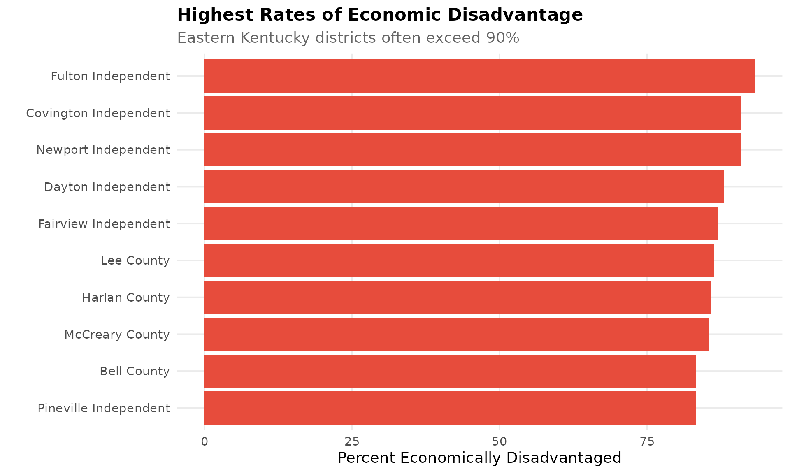

## 8. Kentucky is 71% white

Kentucky remains one of the less diverse states. Louisville and
Lexington have significant minority populations; most rural districts
are 90%+ white.

``` r
s8 <- enr_2024 %>%
  filter(is_state, grade_level == "TOTAL",
         subgroup %in% c("white", "black", "hispanic", "asian")) %>%
  select(subgroup, n_students, pct) %>%
  arrange(desc(pct))
stopifnot(nrow(s8) > 0)
s8
#>   subgroup n_students        pct
#> 1    white     488062 0.71122840
#> 2    black      74804 0.10900814
#> 3 hispanic      69877 0.10182827
#> 4    asian      14529 0.02117239
```

``` r
demo <- enr_2024 %>%
  filter(is_state, grade_level == "TOTAL",
         subgroup %in% c("white", "black", "hispanic", "asian", "multiracial")) %>%
  arrange(desc(pct)) %>%
  mutate(subgroup_label = reorder(subgroup, pct))
stopifnot(nrow(demo) > 0)

print(demo %>% select(subgroup, n_students, pct))
#>      subgroup n_students        pct
#> 1       white     488062 0.71122840
#> 2       black      74804 0.10900814
#> 3    hispanic      69877 0.10182827
#> 4 multiracial      36681 0.05345339
#> 5       asian      14529 0.02117239

ggplot(demo, aes(x = subgroup_label, y = pct * 100)) +
  geom_col(aes(fill = subgroup)) +
  coord_flip() +
  scale_fill_manual(values = c("white" = colors["white"], "black" = colors["black"],
                               "hispanic" = colors["hispanic"], "asian" = colors["asian"],
                               "multiracial" = "#1ABC9C")) +
  labs(title = "Kentucky Student Demographics",
       subtitle = "State is 71% white",
       x = "", y = "Percent of Students") +
  theme_readme() +
  theme(legend.position = "none")
```

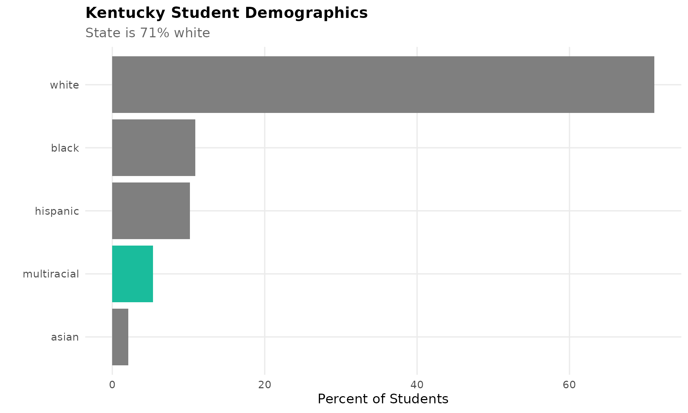

## 9. Boone County is Northern Kentucky’s growth story

Boone County in the Cincinnati suburbs has about 21,500 students. It’s
now the third-largest district in Kentucky.

``` r
s9 <- enr %>%
  filter(grepl("Boone County", district_name, ignore.case = TRUE),
         is_district, grade_level == "TOTAL", subgroup == "total_enrollment") %>%
  select(end_year, n_students)
stopifnot(nrow(s9) > 0)
s9
#>   end_year n_students
#> 1     2020      21935
#> 2     2021      21483
#> 3     2022      21432
#> 4     2023      21384
#> 5     2024      21583
```

``` r
boone <- enr %>%
  filter(is_district, grepl("Boone County", district_name, ignore.case = TRUE),
         subgroup == "total_enrollment", grade_level == "TOTAL")
stopifnot(nrow(boone) > 0)

print(boone %>% select(end_year, n_students))
#>   end_year n_students
#> 1     2020      21935
#> 2     2021      21483
#> 3     2022      21432
#> 4     2023      21384
#> 5     2024      21583

ggplot(boone, aes(x = end_year, y = n_students)) +
  geom_line(linewidth = 1.5, color = colors["total"]) +
  geom_point(size = 3, color = colors["total"]) +
  geom_vline(xintercept = 2020.5, linetype = "dashed", color = "red", alpha = 0.5) +
  annotate("text", x = 2020.7, y = max(boone$n_students), label = "COVID",
           color = "red", alpha = 0.7, hjust = 0, size = 3.5) +
  scale_y_continuous(labels = comma) +
  labs(title = "Boone County - Northern Kentucky Growth",
       subtitle = "Cincinnati suburbs with stable enrollment",
       x = "School Year", y = "Students") +
  theme_readme()
```

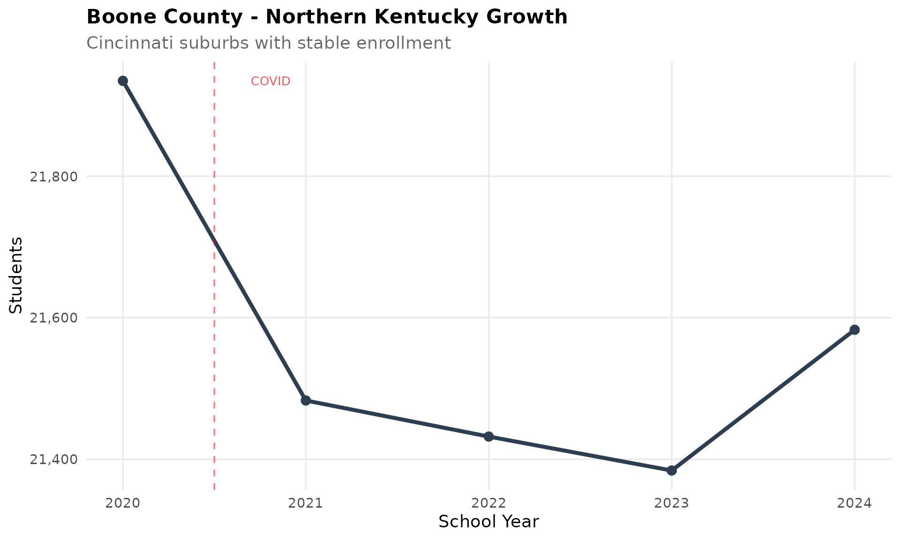

## 10. Independent districts are a Kentucky tradition

Kentucky has both county-wide districts (like Jefferson County) and
independent city districts (like Bowling Green Independent). Some
independent districts serve just a few hundred students.

``` r
s10 <- enr_2024 %>%
  filter(grepl("Independent", district_name, ignore.case = TRUE),
         is_district, grade_level == "TOTAL", subgroup == "total_enrollment") %>%
  arrange(n_students) %>%
  select(district_name, n_students) %>%
  head(10)
stopifnot(nrow(s10) > 0)
s10
#>                 district_name n_students
#> 1       Southgate Independent        221
#> 2         Augusta Independent        337
#> 3          Fulton Independent        341
#> 4         Jackson Independent        384
#> 5       Anchorage Independent        413
#> 6         Jenkins Independent        533
#> 7    Science Hill Independent        538
#> 8  East Bernstadt Independent        545
#> 9          Burgin Independent        546
#> 10       Fairview Independent        582
```

``` r
independent <- enr_2024 %>%
  filter(grepl("Independent", district_name, ignore.case = TRUE),
         is_district, grade_level == "TOTAL", subgroup == "total_enrollment") %>%
  arrange(n_students) %>%
  head(15) %>%
  mutate(district_label = reorder(district_name, n_students))
stopifnot(nrow(independent) > 0)

print(independent %>% select(district_name, n_students))
#>                 district_name n_students
#> 1       Southgate Independent        221
#> 2         Augusta Independent        337
#> 3          Fulton Independent        341
#> 4         Jackson Independent        384
#> 5       Anchorage Independent        413
#> 6         Jenkins Independent        533
#> 7    Science Hill Independent        538
#> 8  East Bernstadt Independent        545
#> 9          Burgin Independent        546
#> 10       Fairview Independent        582
#> 11       Bellevue Independent        626
#> 12 Dawson Springs Independent        632
#> 13      Pineville Independent        639
#> 14        Caverna Independent        752
#> 15   Barbourville Independent        810

ggplot(independent, aes(x = district_label, y = n_students)) +
  geom_col(fill = colors["total"]) +
  coord_flip() +
  scale_y_continuous(labels = comma) +
  labs(title = "Kentucky's Smallest Independent Districts",
       subtitle = "Some serve just a few hundred students with their own school boards",
       x = "", y = "Students") +
  theme_readme()
```

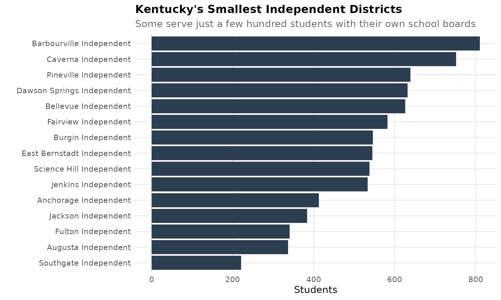

## 11. Louisville is Kentucky’s diversity hub

Jefferson County has significant Black (36%), Hispanic (18%), and Asian
(5%) populations. White students make up only 35% of enrollment in
Louisville.

``` r
s11 <- enr_2024 %>%
  filter(grepl("Jefferson County", district_name, ignore.case = TRUE),
         is_district, grade_level == "TOTAL",
         subgroup %in% c("white", "black", "hispanic", "asian")) %>%
  select(subgroup, n_students, pct)
stopifnot(nrow(s11) > 0)
s11
#>   subgroup n_students        pct
#> 1    white      35817 0.34619511
#> 2    black      37106 0.35865415
#> 3 hispanic      18993 0.18357997
#> 4    asian       5103 0.04932389
```

``` r
# Louisville vs rest of state demographic comparison
jefferson <- enr_2024 %>%
  filter(grepl("Jefferson County", district_name, ignore.case = TRUE),
         is_district, grade_level == "TOTAL",
         subgroup %in% c("white", "black", "hispanic", "asian", "multiracial")) %>%
  mutate(area = "Jefferson County (Louisville)")

state <- enr_2024 %>%
  filter(is_state, grade_level == "TOTAL",
         subgroup %in% c("white", "black", "hispanic", "asian", "multiracial")) %>%
  mutate(area = "Kentucky Statewide")

compare <- bind_rows(jefferson, state) %>%
  mutate(subgroup = factor(subgroup, levels = c("white", "black", "hispanic", "asian", "multiracial")))
stopifnot(nrow(compare) > 0)

print(compare %>% select(area, subgroup, pct))
#>                             area    subgroup        pct
#> 1  Jefferson County (Louisville)       white 0.34619511
#> 2  Jefferson County (Louisville)       black 0.35865415
#> 3  Jefferson County (Louisville)    hispanic 0.18357997
#> 4  Jefferson County (Louisville)       asian 0.04932389
#> 5  Jefferson County (Louisville) multiracial 0.05937618
#> 6             Kentucky Statewide       white 0.71122840
#> 7             Kentucky Statewide       black 0.10900814
#> 8             Kentucky Statewide    hispanic 0.10182827
#> 9             Kentucky Statewide       asian 0.02117239
#> 10            Kentucky Statewide multiracial 0.05345339

ggplot(compare, aes(x = subgroup, y = pct * 100, fill = area)) +
  geom_col(position = "dodge") +
  scale_fill_manual(values = c("Jefferson County (Louisville)" = colors["black"],
                               "Kentucky Statewide" = colors["white"])) +
  labs(title = "Louisville vs Kentucky Demographics",
       subtitle = "Jefferson County is Kentucky's diversity hub",
       x = "", y = "Percent of Students", fill = "") +
  theme_readme()
```

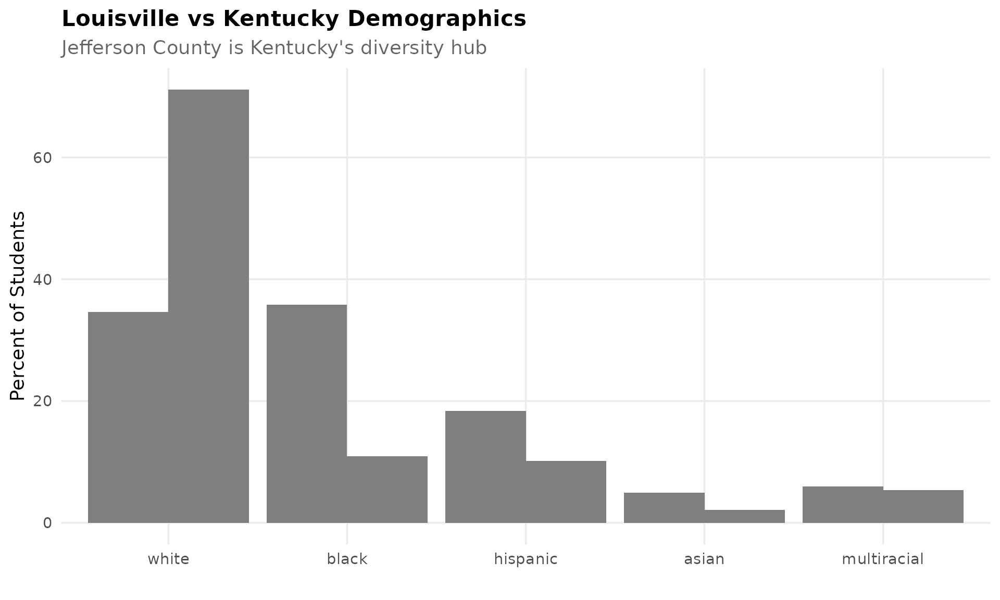

## 12. The gender gap is minimal

Kentucky schools have nearly equal male and female enrollment, with
males at 51.7% and females at 48.3%.

``` r
s12 <- enr_2024 %>%
  filter(is_state, grade_level == "TOTAL",
         subgroup %in% c("male", "female")) %>%
  select(subgroup, n_students, pct)
stopifnot(nrow(s12) > 0)
s12
#>   subgroup n_students       pct
#> 1     male     354795 0.5170251
#> 2   female     331429 0.4829749
```

``` r
gender <- enr_2024 %>%
  filter(is_state, grade_level == "TOTAL",
         subgroup %in% c("male", "female")) %>%
  mutate(subgroup = factor(subgroup, levels = c("male", "female")))
stopifnot(nrow(gender) > 0)

print(gender %>% select(subgroup, n_students, pct))
#>   subgroup n_students       pct
#> 1     male     354795 0.5170251
#> 2   female     331429 0.4829749

ggplot(gender, aes(x = subgroup, y = n_students, fill = subgroup)) +
  geom_col() +
  geom_text(aes(label = paste0(round(pct * 100, 1), "%")), vjust = -0.5, size = 5) +
  scale_y_continuous(labels = comma, expand = expansion(mult = c(0, 0.1))) +
  scale_fill_manual(values = c("male" = colors["white"], "female" = colors["hispanic"])) +
  labs(title = "Gender Balance in Kentucky Schools",
       subtitle = "Near-equal enrollment with slight male majority",
       x = "", y = "Students") +
  theme_readme() +
  theme(legend.position = "none")
```

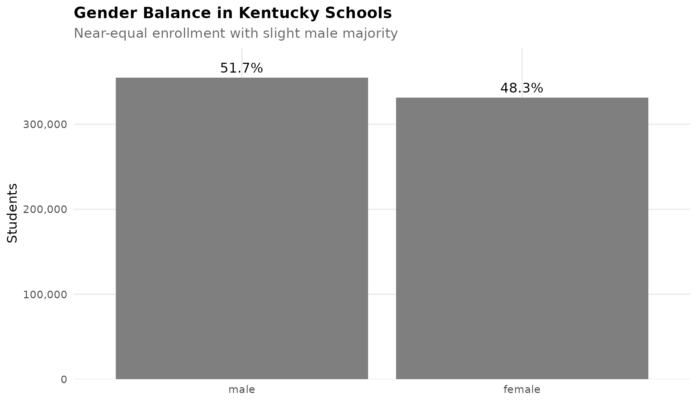

## 13. Oldham County is the wealthy suburb

Oldham County, between Louisville and Lexington, has about 12,500
students. It has Kentucky’s lowest economic disadvantage rate.

``` r
s13 <- enr %>%
  filter(grepl("Oldham County", district_name, ignore.case = TRUE),
         is_district, grade_level == "TOTAL", subgroup == "total_enrollment") %>%
  select(end_year, n_students)
stopifnot(nrow(s13) > 0)
s13
#>   end_year n_students
#> 1     2020      13171
#> 2     2021      12910
#> 3     2022      12875
#> 4     2023      12792
#> 5     2024      12546
```

``` r
oldham <- enr %>%
  filter(is_district, grepl("Oldham County", district_name, ignore.case = TRUE),
         subgroup == "total_enrollment", grade_level == "TOTAL")
stopifnot(nrow(oldham) > 0)

print(oldham %>% select(end_year, n_students))
#>   end_year n_students
#> 1     2020      13171
#> 2     2021      12910
#> 3     2022      12875
#> 4     2023      12792
#> 5     2024      12546

ggplot(oldham, aes(x = end_year, y = n_students)) +
  geom_line(linewidth = 1.5, color = colors["asian"]) +
  geom_point(size = 3, color = colors["asian"]) +
  geom_vline(xintercept = 2020.5, linetype = "dashed", color = "red", alpha = 0.5) +
  annotate("text", x = 2020.7, y = max(oldham$n_students), label = "COVID",
           color = "red", alpha = 0.7, hjust = 0, size = 3.5) +
  scale_y_continuous(labels = comma) +
  labs(title = "Oldham County - The Wealthy Suburb",
       subtitle = "Stable enrollment between Louisville and Lexington",
       x = "School Year", y = "Students") +
  theme_readme()
```

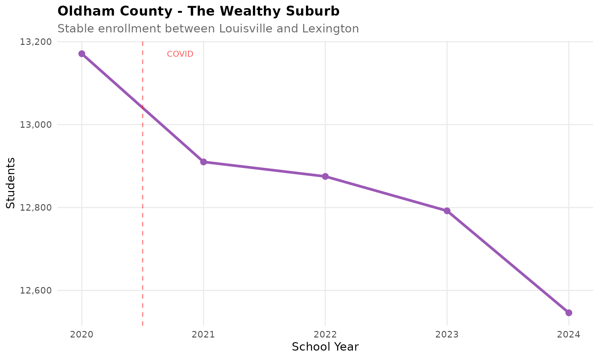

## 14. Harlan County tells the coal story

Harlan County dropped from 4,096 students in 2020 to 3,674 in 2024, a
10% decline in just five years. The county symbolizes the contraction of
coal country in eastern Kentucky.

``` r
s14 <- tryCatch(
  fetch_enr_multi(2020:2024, use_cache = TRUE),
  error = function(e) {
    warning("Failed to fetch Harlan County data: ", e$message)
    NULL
  }
)
stopifnot(!is.null(s14))

s14 <- s14 %>%
  filter(grepl("Harlan County", district_name, ignore.case = TRUE),
         is_district, grade_level == "TOTAL", subgroup == "total_enrollment") %>%
  select(end_year, n_students)
stopifnot(nrow(s14) > 0)
s14
#>   end_year n_students
#> 1     2020       4096
#> 2     2021       3957
#> 3     2022       3827
#> 4     2023       3764
#> 5     2024       3674
```

``` r
harlan <- enr %>%
  filter(is_district, grepl("Harlan County", district_name, ignore.case = TRUE),
         subgroup == "total_enrollment", grade_level == "TOTAL")
stopifnot(nrow(harlan) > 0)

print(harlan %>% select(end_year, n_students))
#>   end_year n_students
#> 1     2020       4096
#> 2     2021       3957
#> 3     2022       3827
#> 4     2023       3764
#> 5     2024       3674

ggplot(harlan, aes(x = end_year, y = n_students)) +
  geom_line(linewidth = 1.5, color = colors["black"]) +
  geom_point(size = 3, color = colors["black"]) +
  geom_vline(xintercept = 2020.5, linetype = "dashed", color = "red", alpha = 0.5) +
  annotate("text", x = 2020.7, y = max(harlan$n_students), label = "COVID",
           color = "red", alpha = 0.7, hjust = 0, size = 3.5) +
  scale_y_continuous(labels = comma) +
  labs(title = "Harlan County - The Coal Story",
       subtitle = "10% enrollment decline in five years",
       x = "School Year", y = "Students") +
  theme_readme()
```

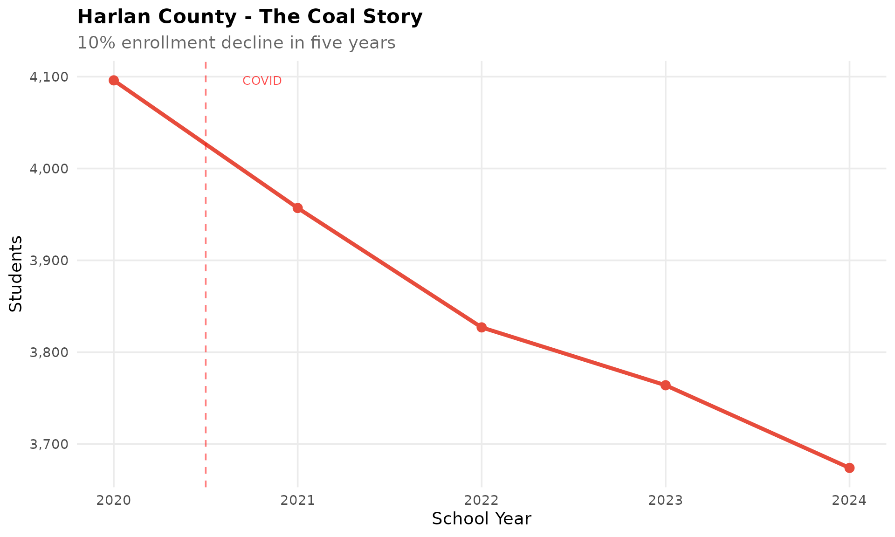

## 15. The multiracial population is growing

Multiracial students now make up 5.3% of Kentucky’s enrollment, up from
4.4% in 2020.

``` r
s15 <- enr %>%
  filter(is_state, grade_level == "TOTAL", subgroup == "multiracial") %>%
  select(end_year, n_students, pct)
stopifnot(nrow(s15) > 0)
s15
#>   end_year n_students        pct
#> 1     2020      30414 0.04354886
#> 2     2021      31949 0.04678067
#> 3     2022      33664 0.04911577
#> 4     2023      35350 0.05143359
#> 5     2024      36681 0.05345339
```

``` r
multiracial <- enr %>%
  filter(is_state, grade_level == "TOTAL", subgroup == "multiracial")
stopifnot(nrow(multiracial) > 0)

print(multiracial %>% select(end_year, n_students, pct))
#>   end_year n_students        pct
#> 1     2020      30414 0.04354886
#> 2     2021      31949 0.04678067
#> 3     2022      33664 0.04911577
#> 4     2023      35350 0.05143359
#> 5     2024      36681 0.05345339

ggplot(multiracial, aes(x = end_year, y = n_students)) +
  geom_line(linewidth = 1.5, color = "#1ABC9C") +
  geom_point(size = 3, color = "#1ABC9C") +
  geom_vline(xintercept = 2020.5, linetype = "dashed", color = "red", alpha = 0.5) +
  annotate("text", x = 2020.7, y = max(multiracial$n_students), label = "COVID",
           color = "red", alpha = 0.7, hjust = 0, size = 3.5) +
  scale_y_continuous(labels = comma) +
  labs(title = "Multiracial Students in Kentucky",
       subtitle = "5.3% of enrollment, up from 4.4% in 2020",
       x = "School Year", y = "Students") +
  theme_readme()
```

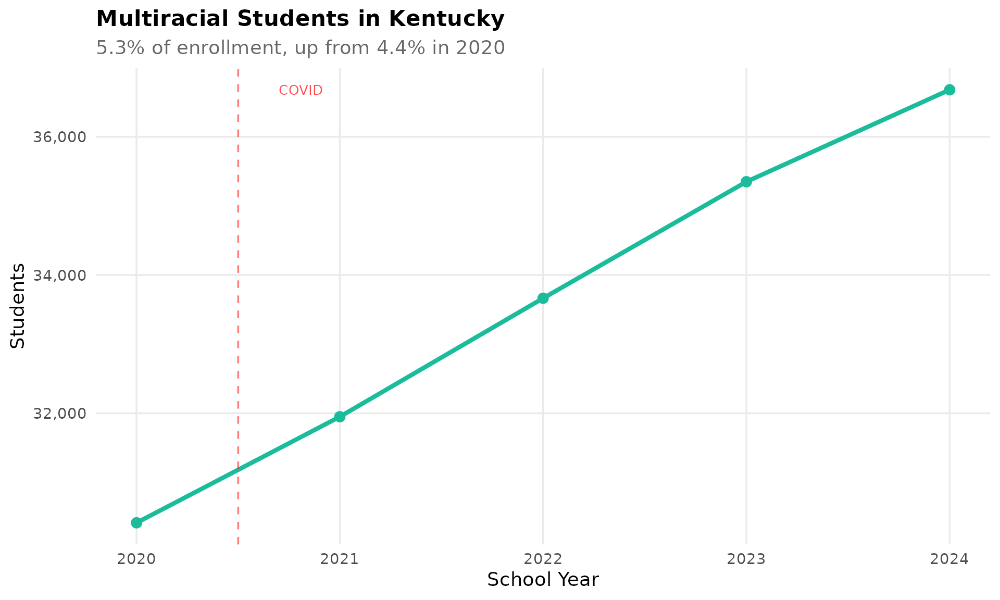

``` r
sessionInfo()
#> R version 4.5.2 (2025-10-31)
#> Platform: x86_64-pc-linux-gnu
#> Running under: Ubuntu 24.04.3 LTS
#> 
#> Matrix products: default
#> BLAS:   /usr/lib/x86_64-linux-gnu/openblas-pthread/libblas.so.3 
#> LAPACK: /usr/lib/x86_64-linux-gnu/openblas-pthread/libopenblasp-r0.3.26.so;  LAPACK version 3.12.0
#> 
#> locale:
#>  [1] LC_CTYPE=C.UTF-8       LC_NUMERIC=C           LC_TIME=C.UTF-8       
#>  [4] LC_COLLATE=C.UTF-8     LC_MONETARY=C.UTF-8    LC_MESSAGES=C.UTF-8   
#>  [7] LC_PAPER=C.UTF-8       LC_NAME=C              LC_ADDRESS=C          
#> [10] LC_TELEPHONE=C         LC_MEASUREMENT=C.UTF-8 LC_IDENTIFICATION=C   
#> 
#> time zone: UTC
#> tzcode source: system (glibc)
#> 
#> attached base packages:
#> [1] stats     graphics  grDevices utils     datasets  methods   base     
#> 
#> other attached packages:
#> [1] scales_1.4.0       dplyr_1.2.0        ggplot2_4.0.2      kyschooldata_0.1.0
#> 
#> loaded via a namespace (and not attached):
#>  [1] bit_4.6.0          gtable_0.3.6       jsonlite_2.0.0     crayon_1.5.3      
#>  [5] compiler_4.5.2     tidyselect_1.2.1   parallel_4.5.2     tidyr_1.3.2       
#>  [9] jquerylib_0.1.4    systemfonts_1.3.1  textshaping_1.0.4  yaml_2.3.12       
#> [13] fastmap_1.2.0      readr_2.2.0        R6_2.6.1           labeling_0.4.3    
#> [17] generics_0.1.4     curl_7.0.0         knitr_1.51         tibble_3.3.1      
#> [21] desc_1.4.3         tzdb_0.5.0         bslib_0.10.0       pillar_1.11.1     
#> [25] RColorBrewer_1.1-3 rlang_1.1.7        cachem_1.1.0       xfun_0.56         
#> [29] fs_1.6.6           sass_0.4.10        S7_0.2.1           bit64_4.6.0-1     
#> [33] cli_3.6.5          pkgdown_2.2.0      withr_3.0.2        magrittr_2.0.4    
#> [37] digest_0.6.39      grid_4.5.2         vroom_1.7.0        hms_1.1.4         
#> [41] rappdirs_0.3.4     lifecycle_1.0.5    vctrs_0.7.1        evaluate_1.0.5    
#> [45] glue_1.8.0         farver_2.1.2       codetools_0.2-20   ragg_1.5.0        
#> [49] purrr_1.2.1        rmarkdown_2.30     httr_1.4.8         tools_4.5.2       
#> [53] pkgconfig_2.0.3    htmltools_0.5.9
```
