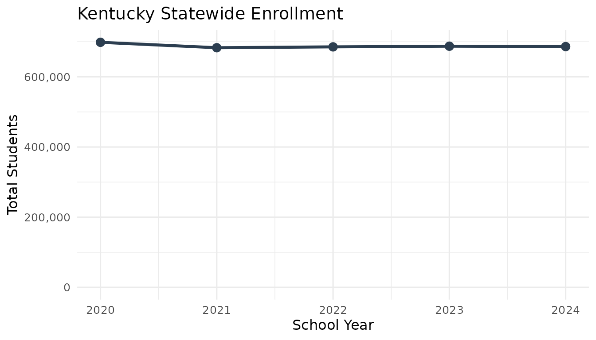

# Getting Started with kyschooldata

## Overview

The `kyschooldata` package provides tools for fetching and analyzing
Kentucky school enrollment data from the Kentucky Department of
Education (KDE). This vignette covers:

1.  Installation and setup
2.  Basic data fetching
3.  Understanding the data schema
4.  Working with district IDs
5.  Filtering and analysis
6.  Multi-year analysis

## Installation

Install from GitHub:

``` r
# install.packages("remotes")
remotes::install_github("almartin82/kyschooldata")
```

Load the package along with helpful companions:

``` r
library(kyschooldata)
library(dplyr)
library(ggplot2)
```

## Data Availability

Kentucky has extensive historical data spanning nearly three decades:

``` r
# Check available years
years <- get_available_years()
cat(sprintf("Data available from %d to %d\n", years$min_year, years$max_year))
```

    ## Data available from 1997 to 2024

| Years     | Source             | Aggregation Levels      | Demographics                      |
|-----------|--------------------|-------------------------|-----------------------------------|
| 2020-2024 | SRC Current Format | State, District, School | Race, Gender, Special Populations |
| 2012-2019 | SRC Historical     | State, District, School | Race, Gender, Special Populations |
| 1997-2011 | SAAR Data          | State, District         | Race                              |

## Basic Data Fetching

### Fetch a Single Year

The main function is
[`fetch_enr()`](https://almartin82.github.io/kyschooldata/reference/fetch_enr.md),
which downloads and processes enrollment data:

``` r
# Fetch 2024 enrollment data (2023-24 school year)
enr_2024 <- fetch_enr(2024, use_cache = TRUE)

# View the first few rows
head(enr_2024)
```

    ##   end_year     type district_id school_id district_name
    ## 1     2024    State        <NA>      <NA>          <NA>
    ## 2     2024 District         999      <NA> All Districts
    ## 3     2024 District         001      <NA>  Adair County
    ## 4     2024   School         001       010  Adair County
    ## 5     2024   School         001       012  Adair County
    ## 6     2024   School         001       014  Adair County
    ##                  school_name grade_level         subgroup n_students pct
    ## 1                       <NA>       TOTAL total_enrollment    1397078   1
    ## 2                       <NA>       TOTAL total_enrollment     686224   1
    ## 3                       <NA>       TOTAL total_enrollment       3068   1
    ## 4   Adair County High School       TOTAL total_enrollment        847   1
    ## 5     Adair Learning Academy       TOTAL total_enrollment        263   1
    ## 6 Adair County Middle School       TOTAL total_enrollment        632   1
    ##   is_state is_district is_school aggregation_flag
    ## 1     TRUE       FALSE     FALSE            state
    ## 2    FALSE        TRUE     FALSE         district
    ## 3    FALSE        TRUE     FALSE         district
    ## 4    FALSE       FALSE      TRUE           campus
    ## 5    FALSE       FALSE      TRUE           campus
    ## 6    FALSE       FALSE      TRUE           campus

### Understanding the Year Parameter

The `end_year` parameter represents the end of the academic year:

- `2024` = 2023-24 school year
- `2023` = 2022-23 school year
- etc.

## Understanding the Data Schema

### Tidy Format (Default)

By default,
[`fetch_enr()`](https://almartin82.github.io/kyschooldata/reference/fetch_enr.md)
returns data in **tidy (long) format**. Each row represents a single
observation for one entity, grade level, and subgroup combination.

``` r
# Key columns in tidy format
enr_2024 %>%
  select(end_year, district_id, school_id, district_name,
         type, grade_level, subgroup, n_students, pct) %>%
  head(10)
```

    ##    end_year district_id school_id district_name     type grade_level
    ## 1      2024        <NA>      <NA>          <NA>    State       TOTAL
    ## 2      2024         999      <NA> All Districts District       TOTAL
    ## 3      2024         001      <NA>  Adair County District       TOTAL
    ## 4      2024         001       010  Adair County   School       TOTAL
    ## 5      2024         001       012  Adair County   School       TOTAL
    ## 6      2024         001       014  Adair County   School       TOTAL
    ## 7      2024         001       016  Adair County   School       TOTAL
    ## 8      2024         001       020  Adair County   School       TOTAL
    ## 9      2024         005      <NA>  Allen County District       TOTAL
    ## 10     2024         005       010  Allen County   School       TOTAL
    ##            subgroup n_students pct
    ## 1  total_enrollment    1397078   1
    ## 2  total_enrollment     686224   1
    ## 3  total_enrollment       3068   1
    ## 4  total_enrollment        847   1
    ## 5  total_enrollment        263   1
    ## 6  total_enrollment        632   1
    ## 7  total_enrollment        605   1
    ## 8  total_enrollment        722   1
    ## 9  total_enrollment       3336   1
    ## 10 total_enrollment       1083   1

| Column          | Description                                 |
|-----------------|---------------------------------------------|
| `end_year`      | School year end (e.g., 2024 for 2023-24)    |
| `district_id`   | 3-digit district code                       |
| `school_id`     | 6-digit school code (NA for district-level) |
| `district_name` | Name of the district                        |
| `school_name`   | Name of the school (NA for district-level)  |
| `type`          | “State”, “District”, or “School”            |
| `grade_level`   | Grade level (“TOTAL”, “PK”, “K”, “01”-“12”) |
| `subgroup`      | Demographic or population subgroup          |
| `n_students`    | Student count                               |
| `pct`           | Percentage of total enrollment              |

### Subgroups

The `subgroup` column identifies demographic categories:

- `total_enrollment`: Total student count
- **Race/Ethnicity**: `white`, `black`, `hispanic`, `asian`,
  `native_american`, `pacific_islander`, `multiracial`
- **Special Populations**: `econ_disadv`, `lep`, `special_ed`

``` r
# See all subgroups
enr_2024 %>%
  distinct(subgroup) %>%
  pull(subgroup)
```

    ##  [1] "total_enrollment" "white"            "black"            "hispanic"        
    ##  [5] "asian"            "native_american"  "pacific_islander" "multiracial"     
    ##  [9] "male"             "female"           "special_ed"       "lep"             
    ## [13] "econ_disadv"

## Working with District IDs

Kentucky uses a hierarchical ID system:

- **District ID:** 3 digits (e.g., 275 for Jefferson County)
- **School ID:** 6 digits (district + 3-digit school code)

### Major Districts

| District ID | District Name                 |
|-------------|-------------------------------|
| 275         | Jefferson County (Louisville) |
| 180         | Fayette County (Lexington)    |
| 045         | Boone County                  |
| 360         | Kenton County                 |
| 110         | Daviess County                |

### Finding Districts

``` r
# Search for a district by name
enr_2024 %>%
  filter(is_district, subgroup == "total_enrollment", grade_level == "TOTAL") %>%
  filter(grepl("Jefferson", district_name, ignore.case = TRUE)) %>%
  select(district_id, district_name, n_students)
```

    ##   district_id    district_name n_students
    ## 1         275 Jefferson County     103459

## Filtering Data

### Aggregation Level Flags

The data includes boolean flags to identify aggregation levels:

``` r
# State totals
state <- enr_2024 %>% filter(is_state)

# All districts (excluding state totals)
districts <- enr_2024 %>% filter(is_district)

# All schools
schools <- enr_2024 %>% filter(is_school)
```

### Common Filters

``` r
# State total enrollment
enr_2024 %>%
  filter(is_state, subgroup == "total_enrollment", grade_level == "TOTAL") %>%
  select(end_year, n_students)
```

    ##   end_year n_students
    ## 1     2024    1397078

``` r
# Top 10 districts by enrollment
enr_2024 %>%
  filter(is_district, subgroup == "total_enrollment", grade_level == "TOTAL") %>%
  arrange(desc(n_students)) %>%
  select(district_name, n_students) %>%
  head(10)
```

    ##       district_name n_students
    ## 1     All Districts     686224
    ## 2  Jefferson County     103459
    ## 3    Fayette County      44362
    ## 4      Boone County      21583
    ## 5     Warren County      20394
    ## 6     Hardin County      16287
    ## 7     Kenton County      14645
    ## 8    Bullitt County      13674
    ## 9     Oldham County      12546
    ## 10   Daviess County      12011

``` r
# Demographics for state
enr_2024 %>%
  filter(is_state, grade_level == "TOTAL",
         subgroup %in% c("white", "black", "hispanic", "asian")) %>%
  select(subgroup, n_students, pct)
```

    ##   subgroup n_students        pct
    ## 1    white     994258 0.71166964
    ## 2    black     152218 0.10895455
    ## 3 hispanic     141735 0.10145103
    ## 4    asian      29203 0.02090291

## Multi-Year Analysis

### Fetch Multiple Years

``` r
# Fetch a range of years
enr_recent <- fetch_enr_multi(2020:2024, use_cache = TRUE)

# View statewide trend
enr_recent %>%
  filter(is_state, subgroup == "total_enrollment", grade_level == "TOTAL") %>%
  select(end_year, n_students)
```

    ##   end_year n_students
    ## 1     2020    1472317
    ## 2     2021    1434970
    ## 3     2022    1451381
    ## 4     2023    1456127
    ## 5     2024    1397078

### Historical Analysis

``` r
# Fetch early years (SAAR data - district level only)
enr_early <- fetch_enr_multi(2000:2005, use_cache = TRUE)

enr_early %>%
  filter(is_state, subgroup == "total_enrollment", grade_level == "TOTAL") %>%
  select(end_year, n_students)
```

    ## [1] end_year   n_students
    ## <0 rows> (or 0-length row.names)

## Visualization Example

``` r
# State enrollment trend
state_trend <- enr_recent %>%
  filter(is_state, subgroup == "total_enrollment", grade_level == "TOTAL")

ggplot(state_trend, aes(x = end_year, y = n_students)) +
  geom_line(linewidth = 1.2, color = "#2C3E50") +
  geom_point(size = 3, color = "#2C3E50") +
  scale_y_continuous(labels = scales::comma, limits = c(0, NA)) +
  labs(
    title = "Kentucky Statewide Enrollment",
    x = "School Year",
    y = "Total Students"
  ) +
  theme_minimal(base_size = 12)
```



## Next Steps

- Explore the [Enrollment Trends
  vignette](https://almartin82.github.io/kyschooldata/articles/enrollment-trends.md)
  for in-depth analysis with visualizations
- See the [function
  reference](https://almartin82.github.io/kyschooldata/reference/index.md)
  for detailed documentation
- Check
  [`?fetch_enr`](https://almartin82.github.io/kyschooldata/reference/fetch_enr.md)
  for parameter details

``` r
sessionInfo()
```

    ## R version 4.5.2 (2025-10-31)
    ## Platform: x86_64-pc-linux-gnu
    ## Running under: Ubuntu 24.04.3 LTS
    ## 
    ## Matrix products: default
    ## BLAS:   /usr/lib/x86_64-linux-gnu/openblas-pthread/libblas.so.3 
    ## LAPACK: /usr/lib/x86_64-linux-gnu/openblas-pthread/libopenblasp-r0.3.26.so;  LAPACK version 3.12.0
    ## 
    ## locale:
    ##  [1] LC_CTYPE=C.UTF-8       LC_NUMERIC=C           LC_TIME=C.UTF-8       
    ##  [4] LC_COLLATE=C.UTF-8     LC_MONETARY=C.UTF-8    LC_MESSAGES=C.UTF-8   
    ##  [7] LC_PAPER=C.UTF-8       LC_NAME=C              LC_ADDRESS=C          
    ## [10] LC_TELEPHONE=C         LC_MEASUREMENT=C.UTF-8 LC_IDENTIFICATION=C   
    ## 
    ## time zone: UTC
    ## tzcode source: system (glibc)
    ## 
    ## attached base packages:
    ## [1] stats     graphics  grDevices utils     datasets  methods   base     
    ## 
    ## other attached packages:
    ## [1] ggplot2_4.0.1      dplyr_1.1.4        kyschooldata_0.1.0
    ## 
    ## loaded via a namespace (and not attached):
    ##  [1] gtable_0.3.6       jsonlite_2.0.0     compiler_4.5.2     tidyselect_1.2.1  
    ##  [5] jquerylib_0.1.4    systemfonts_1.3.1  scales_1.4.0       textshaping_1.0.4 
    ##  [9] readxl_1.4.5       yaml_2.3.12        fastmap_1.2.0      R6_2.6.1          
    ## [13] labeling_0.4.3     generics_0.1.4     curl_7.0.0         knitr_1.51        
    ## [17] tibble_3.3.1       desc_1.4.3         bslib_0.9.0        pillar_1.11.1     
    ## [21] RColorBrewer_1.1-3 rlang_1.1.7        cachem_1.1.0       xfun_0.56         
    ## [25] fs_1.6.6           sass_0.4.10        S7_0.2.1           cli_3.6.5         
    ## [29] pkgdown_2.2.0      withr_3.0.2        magrittr_2.0.4     digest_0.6.39     
    ## [33] grid_4.5.2         rappdirs_0.3.4     lifecycle_1.0.5    vctrs_0.7.0       
    ## [37] evaluate_1.0.5     glue_1.8.0         cellranger_1.1.0   farver_2.1.2      
    ## [41] codetools_0.2-20   ragg_1.5.0         httr_1.4.7         purrr_1.2.1       
    ## [45] rmarkdown_2.30     tools_4.5.2        pkgconfig_2.0.3    htmltools_0.5.9
